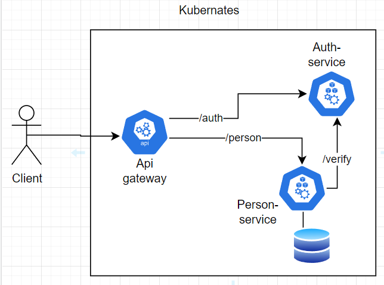

# Выполнение домашнего задания : "Backend for frontends. Apigateway"

Установка приложения выполняется с помощью helm командой:
helm install gateway ./api-gateway-chart

Схема взаимодействия: 

Для тестирования использовать коллекцию Postman:  [коллеция postman](postman_collection.json).
При запуске через newman выводятся headers и bodies для request и response.
Команды вызова: newman run <Collection_name>